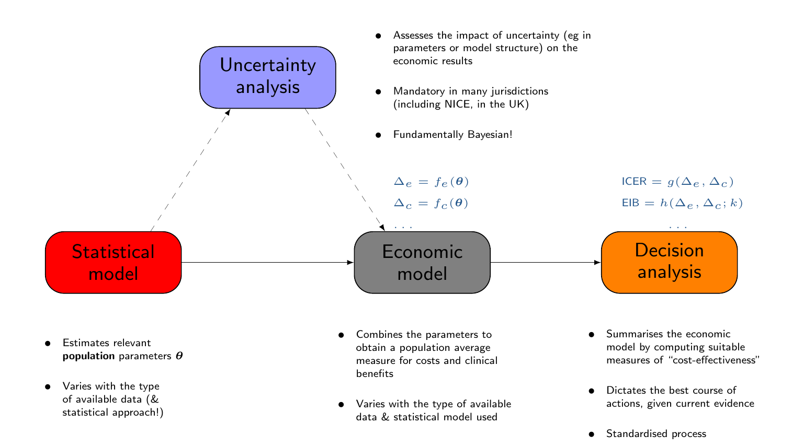
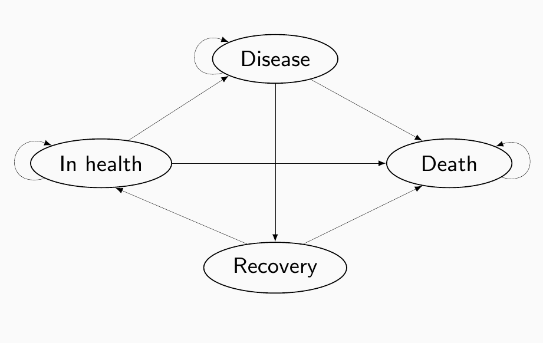
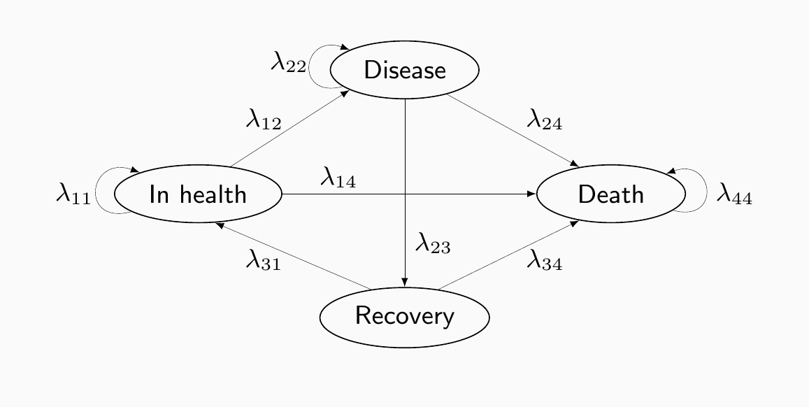
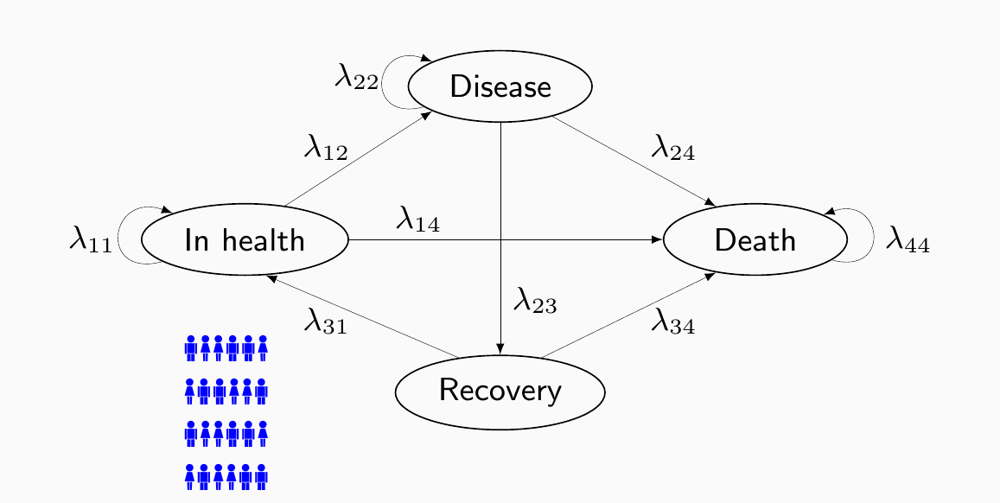
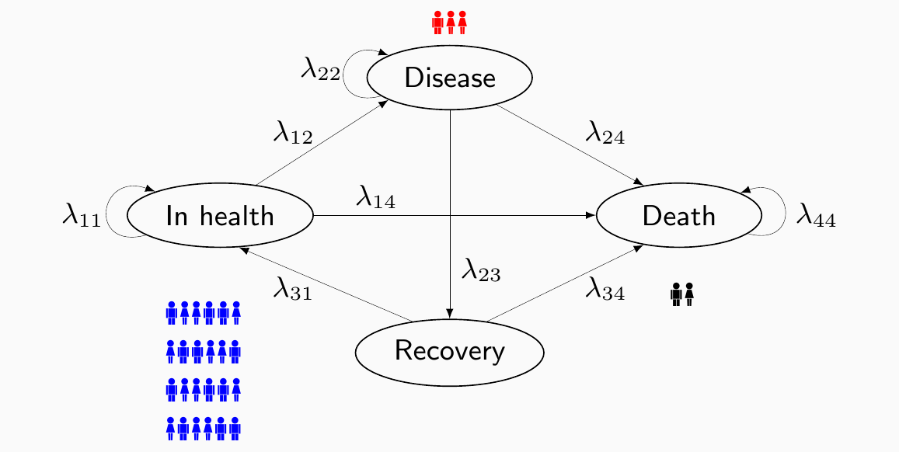
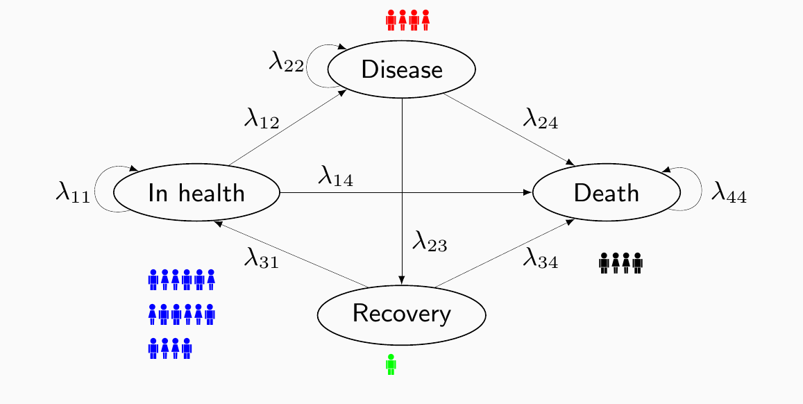
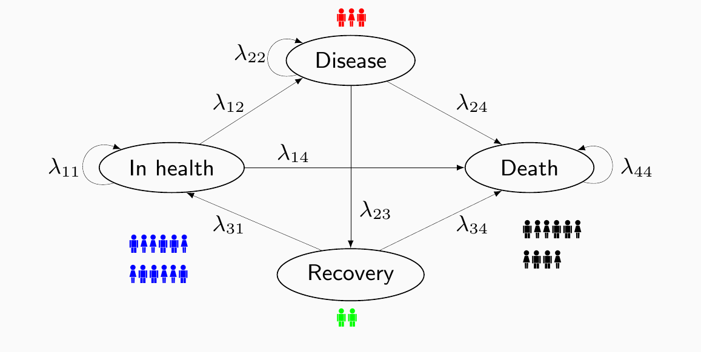
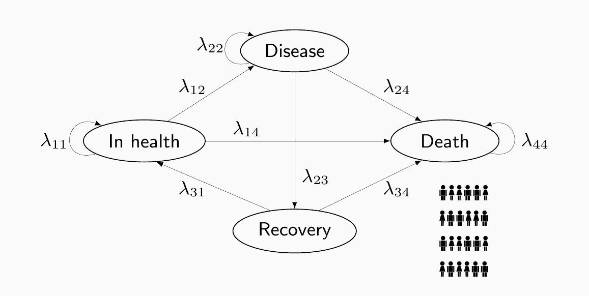
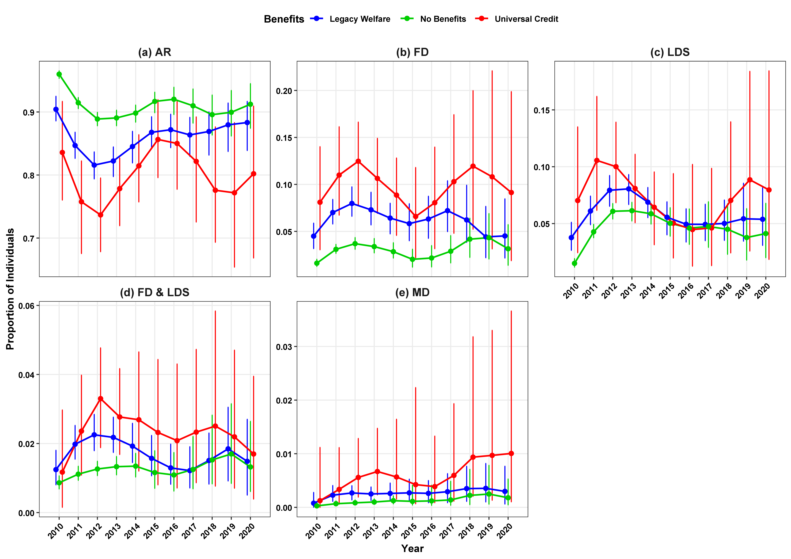

---
#' Format. Here selects the style of the slides; other choices are 'gb-revealjs' or 'sampdoria-revealjs'
format: 
  ucl-revealjs
#' Should the compiled images have a transparent background? (good for UCL2026 style)
img-bg: true
from: markdown+emoji


#' Dynamic attributes (specific info to the slides being prepared)
title: "From Reform to Reassessment: Universal Credit in the Shadow of Its Predecessor"
shorttitle: "Economic evaluation of the UC implementation"
subtitle: ""
date: "2 July 2026"
conference:
   name: EPITOME End-of-Grant Workshop
   location: UCL
   session: 
shortconference: "EPITOME Workshop"
postit: 
   random-talks: true
   social-media: true
slidesurl: 
   show: false
   url: "[https://gianluca.statistica.it/slides/XXX](https://gianluca.statistica.it/slides/XXX)"
   size: "0.75em"
thank-you: 
   show: true
   file: reese
bibliography: "/home/gianluca/Dropbox/Rstuff/Website/publications/mypubs.bib"


#' (Semi-)Fixed attributes (don't need to, but can change these)
author: 
  - name: "Gianluca Baio"
institute:  
   - uni: "Department of Statistical Science &nbsp; | &nbsp; University College London"
email: 
   text: "[g.baio@ucl.ac.uk](mailto:g.baio@ucl.ac.uk)"
   icon: "[]{style='color:#00acee; height: 0.8em'}"
url: 
  - text: "[https://gianluca.statistica.it](https://gianluca.statistica.it)"
    icon: "[]{style='color: #00acee; height: 0.8em'}"
  - text: "[https://egon.stats.ucl.ac.uk/research/statistics-health-economics](https://egon.stats.ucl.ac.uk/research/statistics-health-economics)"
    icon: "[]{style='color: #00acee; height: 0.8em'}"
github: 
  - text: "[https://github.com/giabaio](https://github.com/giabaio)"
    icon: "[]{style='color: white; height: 0.8em'}"
  - text: "[https://github.com/StatisticsHealthEconomics](https://github.com/StatisticsHealthEconomics)"
    icon: "[]{style='color: white; height: 0.8em'}"
social: 
  - text: '[\@gianlubaio@mas.to](https://mas.to/@gianlubaio)'
    icon: "[]{style='color: #6364FF; height: 0.8em'}" 
  # - text: '[\@gianlubaio](https://twitter.com/gianlubaio)'
  #   icon: "[]{style='color: black; height: 0.8em'}"
  - text: '[gianluca-baio](https://www.linkedin.com/in/gianluca-baio/)'
    icon: "[]{style='color: #0A66C2; height: 0.8em'}" 
orchid: 
   show: false
   url: "[https://orcid.org/0000-0003-4314-2570](https://orcid.org/0000-0003-4314-2570)"
   icon: "[]{style='color: white; height: 0.8em'}"
date-format: "D MMMM YYYY"
#' Here defines the elements of the footer. May want to change the various elements
footer: |
   &copy; Gianluca Baio (UCL) &nbsp; | &nbsp; 
      [](https://www.linkedin.com/in/gianluca-baio/){title='Follow me on LinkedIn'} &nbsp;
      [](https://mas.to/@gianlubaio){title='Follow me on Mastodon'} &nbsp;
      [](https://github.com/giabaio){title='Check out my repos'} &nbsp;
      [](mailto:g.baio@ucl.ac.uk){title='Email me'} &nbsp;
      [](https://gianluca.statistica.it){title='Visit my website'} &nbsp; | &nbsp;
         
      <!-- [](https://twitter.com/giabaio){title='Follow me on X'} &nbsp; -->


#' Filters
filters:
 - code-visibility
lightbox: auto


#' Computed attributes (from other parts of the yml file)
date-as-string: '`r ifelse((rmarkdown::metadata$date)!="",(rmarkdown::metadata$date |> as.Date(format("%e %B %Y")) |> format("%e %B %Y")),(Sys.Date() |> format("%e %B %Y")))`'
shortdate: '`r ifelse((rmarkdown::metadata$date)!="",(rmarkdown::metadata$date |> as.Date(format("%e %B %Y")) |> format("%e %b %Y")),(Sys.Date() |> format("%e %b %Y")))`'
shorttitle-string: '`r ifelse((rmarkdown::metadata$shorttitle)!="",paste(rmarkdown::metadata$shorttitle,"&nbsp; | &nbsp;"),"")`'
shortconference-string: '`r ifelse((rmarkdown::metadata$shortconference)!="",paste(rmarkdown::metadata$shortconference,"&nbsp; | &nbsp;"),"")`'
slides-url: |
   `r ifelse(
      (rmarkdown::metadata$slidesurl$show)==TRUE,
      paste("&nbsp; | &nbsp; [ Slides available at ",
      rmarkdown::metadata$slidesurl$url,"]{style=\"font-size:",rmarkdown::metadata$slidesurl$size,";\"}"),""
   )`
---

```{r}
#| label: setup
#| echo: false
# Loads 'tidyverse' & 'slides'
library(tidyverse, quietly=TRUE)
library(slides)

# Runs setup commands from the 'assets/setup.R' file
source("assets/setup.R")
```

# Disclaimer {.divider}

This presentation is a summary of the work conducted in Work-Package 4

- I can take all the credit (...), but in reality, this has been driven by the fantastic work of **Ioannis Rotous**
- Key contributions to this work have arrived from all the other EPITOME researchers (e.g. in discussions for the methodological framework to represent the underlying processes, as well as for the formalisation of the statistical modelling)

::: {.aside}
Rotous I, Jeffery A, Gascoigne C, Yu X, Blangiardo M, Geneletti S, Kirkbride J, Baio, G (2026). From Reform to Reassessment: Universal Credit in the Shadow of Its Predecessor". Submitted as Read Paper to the *Journal of the Royal Statistical Society*, Series A -- under second round of revisions. :crossed_fingers:
:::

## EPITOME

```{=html}
<style>
li:has(> .semi-transparent) {
  opacity: 0.5;
}
li:has(> .semi-transparent)::marker {
  opacity: 0.5;
}
.semi-transparent {
  opacity: 0.5;
}
</style>
```

***Evaluating Policy Implementation TO Predict MEntal health: a Bayesian hierarchical framework for quasi-experimental designs in longitudinal settings***

- [**WP1: hierarchical statistical framework**]{.semi-transparent}
  - [Core Bayesian time series model with spatial/temporal dependency, extended to stepped wedge and matched-control designs]{.semi-transparent}
  - [Simulation study to assess robustness and sensitivity to model and prior choices]{.semi-transparent}
- [**WP2: evaluating impact on mental health need in England**]{.semi-transparent}
  - [Apply the framework to five UK datasets to estimate effects of Universal Credit and the Hostile Environment Policy]{.semi-transparent}
  - [Test for independent and combined effects across socioeconomic and ethnic minority groups]{.semi-transparent}
- [**WP3: developing alternative controls**]{.semi-transparent}
  - [Develop Bayesian synthetic control and negative outcome control methods for cases with no standard control group]{.semi-transparent}
  - [Apply these to the WP2 case studies and extend simulations to guide their use]{.semi-transparent}
- **WP4: economic evaluation**
  - Extend existing forecasting models into a Bayesian framework, propagating uncertainty from WP1 to WP3
  - Use multi-state modelling and potentially Value of Information analysis to assess service demand and decision adequacy

## Background

### Context

- **The Legacy System** (LW): A complex, post-WWII evolved safety net that often required multiple, non-integrated applications for different areas of support
- **The Reform Goal**: The 2010s policy shift aimed to replace this administrative complexity with Universal Credit (UC) -- a single, integrated payment structure
- Primary Policy Aims:
  - *Efficiency*. Streamline administration to reduce system errors and fraud
  - *Incentive*. Create a "work-first" culture by smoothing the transition from benefit dependency to employment
  - *Simplicity*. Reduce the burden on claimants to navigate multiple government agencies

::: {.fragment fragment-index="2" style="margin-top: 20px"}
### Research gap & objectives

- No previous research has modelled the dynamic co-evolution of benefit status and well-being
- In addition, existing literature generally has not quantified the trade-off between government expenditure and long-term socioeconomic outcomes
- **Objective**: conduct the first formal economic evaluation comparing UC to LW
  - Use Health Technology Assessment (HTA) tools to map the entire "welfare trajectory", not just individual symptoms
:::

## Health technology assessment (HTA) {transition="slide-out" transition-speed="slow"}

#### Objective

- Combine [costs]{.myred} and [benefits]{.myblue} of a given intervention into a rational scheme for allocating resources

<center>{width="80%"}</center>

## Multi-state/Markov models

- Assume a set $\mathcal{S}$ made of $S$ "clinically relevant" states
  - Exhaustive and mutually exclusive
- The **structure** (links among nodes) describes the dynamics of disease history
  - Links connecting two states encode the assumption that a transition from the one where the link originates to the one reached by it is possible
  - Absence of a link between two states implies that the transition from one to the other is not allowed by the model

. . .

- From one period to the next, subjects can move across the states according to the rules specified by the links

- Movements occur according to suitable **transition probabilities** $$\color{#24568c}\bm\pi_j = \bm\pi_{j-1} \bm\Lambda_j$$ where

  - $\bm\pi_j=(\pi_{1j},\ldots,\pi_{Sj})$ is the vector of probabilities for each state at time $j$
  - $\bm\Lambda_j = [\Lambda_{j;s',s}]$ is a transition matrix describing the probability of moving from state $s$ to state $s'$ at time $j$

. . .

- **NB** the matrix algebra simply computes for each state $s$

$$\color{blue}{\Pr(`r sftext("Being in state ")` s `r sftext(" at time ")` j)= \sum_{s'\in\mathcal{S}}\Pr(`r sftext("Being in state ")` s' `r sftext(" at time ")` j-1)\times \Pr(`r sftext("Moving from state ")`s'`r sftext(" to state ")`s)}$$

## Multi-state/Markov models {visibility="uncounted"}

### 1. Define a structure (e.g. "**Natural history**" of the disease)

{width="43%" fig-align="center"}

## Multi-state/Markov models {visibility="uncounted"}

### 2. Estimate the transition probabilities

{width="55%" fig-align="center"}

`r vspace("-20px")`

For instance:

- $\lambda_{14} =$ general (healthy) population mortality $\Rightarrow$ Relevant data: Life tables/official records, . . .
- $\lambda_{24} =$ disease-specific mortality $\Rightarrow$ Relevant data: Trial/observational studies, . . .
- $\ldots$

## Multi-state/Markov models {visibility="uncounted"}

### 3. Run the simulation: $j=0$

{width="55%" fig-align="center"}

`r vspace("20px")`

Distribute the "virtual cohort" across the $S$ states (typically, everybody starts in the "healthy" state...)

## Multi-state/Markov models {visibility="uncounted"}

### 3. Run the simulation: $j=1$

{width="55%" fig-align="center"}

`r vspace("20px")` Start moving people around...

## Multi-state/Markov models {visibility="uncounted"}

### Matrix algebra and "state occupancy"

- $m_{sj}$ is the **number** of people in state $s$ at time $j$

- $\lambda_{s'sj}$ is the probability of moving from state $s'$ to state $s$ between time $j$ and $j+1$

`r vspace("20px")`

- Thus:

$$\color{#24568c}{m_{s\, j+1} = m_{1j}\lambda_{1sj} + m_{2j}\lambda_{2sj} + \ldots + m_{Sj}\lambda_{Ssj}}$$

[which we can write in matrix algebra as]{.list-space}

\begin{align}
\color{#24568c}{(m_{1\, j+1},\ldots,m_{S\, j+1})} & \color{#24568c}{=\, (m_{1\, j},\ldots,m_{S\, j})\left(\begin{array}{ccc}\lambda_{11j} & \ldots & \lambda_{1Sj} \\ \vdots & \ddots & \vdots \\ \lambda_{S1j} & \ldots & \lambda_{SSj}  \end{array}\right)} \\
\color{#24568c}{\bm{m}_{j+1}} & \color{#24568c}{= \, \bm{m}_{j} \bm\Lambda_j}
\end{align}

`r vspace("30px")`

- **NB**: The transition matrix typically does depend on the time $j$, but sometimes we can relax this assumption

## Multi-state/Markov models {visibility="uncounted"}

### 3. Run the simulation: $j=2$

{width="55%" fig-align="center"}

`r vspace("20px")`

Move people around according to the relationship $\bm{m}_{2}=\bm{m}_{1}\bm\Lambda_{1}$

## Multi-state/Markov models {visibility="uncounted"}

### 3. Run the simulation: $j=3$

{width="55%" fig-align="center"}

`r vspace("20px")`

Move people around according to the relationship $\bm{m}_{3}=\bm{m}_{2}\bm\Lambda_{2}$

## Multi-state/Markov models {visibility="uncounted"}

### 3. Run the simulation: $j=J$ ("*lifetime* horizon")

{width="55%" fig-align="center"}

`r vspace("30px")`

- We can associate suitable measures of cost and benefits with each state
- With these, we can compute the overall economic value of different policies
  - Each policy will generally have different distributions of the time spent in each state
  - This in turn determines different costs & benefits...

## Data source & sample selection

- Longitudinal data from [Understanding Society (UKHLS)](https://www.understandingsociety.ac.uk/), 40,000+ households tracked since 2009
  - Focus on working-age (16-64) individuals in Great Britain
  - Exclude those with pre-existing lifetime illnesses or disabilities to ensure results reflect policy impacts rather than health crises
- Study cohorts:
  - Universal Credit (6%): exposed to UC between 2013-2020
  - Legacy Welfare (40%): exclusive to the old benefit system
  - No Benefit (54%): never claimed support
  
`r vspace("30px")`

- **NB**: UC rollout was administratively mandated, not triggered by personal life shocks, allowing us to evaluate the effects of the policy change

## Multi-state modelling for the UC/LW evaluation

:::::: columns
::: {.column width="55%"}
```{r mm1, engine='tikz',echo=F}
#| out-width: "90%"
#| fig-align: "center"

\definecolor{sampred}{HTML}{C21718}
\definecolor{sampblue}{HTML}{1B5497}
\definecolor{italiangreen}{HTML}{009246}
\definecolor{spanishyellow}{HTML}{ffc400}
\definecolor{olive}{HTML}{334f17}
\definecolor{sampblue}{HTML}{1B5497}
\definecolor{lightblue}{HTML}{90D5FF}

\usetikzlibrary{shapes.geometric, arrows,automata, positioning}
\begin{tikzpicture}[shorten >=1pt, node distance=2.7cm, auto, on grid, font=\sffamily]
    % Define the states
    \node[draw = none] (AR) {\color{blue}AR};
    
    \node[state, opacity = 0] (B) [right=of AR] {B};
    \node[state, opacity = 0] (C) [left=of AR]  {C};
    
    \node[draw = none] (FD) [below right=of B] {\color{olive}FD};
    \node[draw = none] (LDS) [below left=of C] {\color{purple}LDS};

    \node[state, opacity = 0] (F) [below=of FD] {F};
    \node[state, opacity = 0] (G) [below=of LDS] {G};

    \node[draw = none] (MD) [below=of G] {\color{spanishyellow}MD};
    \node[draw = none] (FDCMD) [below=of F] {\color{italiangreen}FD  \& LDS};

    \node[state, opacity = 0] (J) [below=of FDCMD] {J};
    \node[state, opacity = 0] (K) [below=of MD] {K};
     \node[state, opacity = 0] (L) [right=of K] {L};
    \node[draw = none] (WE) [below right=of K] {\color{lightblue}WE};
     \node[draw = none] (WI) [below left=of J] {$\color{orange}\text{WE}^{c}$};

    

    % Define the transitions
    \path[<->, shorten >=0pt, shorten <=0pt]
        % Self-loops
        (AR) edge [loop above] node {\scalebox{0.8}{$\lambda_{1,1}^{g,t}$}} (AR)
        (FD) edge [loop right] node {\scalebox{0.8}{$\lambda_{2,2}^{g,t}$}} (FD)
        (LDS) edge [loop left] node {\scalebox{0.8}{$\lambda_{3,3}^{g,t}$}} (LDS)
        (FDCMD) edge [loop right] node {\scalebox{0.8}{$\lambda_{4,4}^{g,t}$}} (FDCMD)
        (MD) edge [loop left] node {\scalebox{0.8}{$\lambda_{5,5}^{g,t}$}} (MD)
        (WE) edge [loop below] node {\scalebox{0.8}{$\chi_{6,6}^{g,t}$}} (WE)
        (WI) edge [loop below] node {\scalebox{0.8}{$\chi_{7,7}^{g,t}$}} (WI)

        % Transitions from RP
        (AR) edge[bend left = 15] node[pos=0.83, sloped, allow upside down] {\scalebox{0.8}{$\lambda_{1,2}^{g,t}$}} node[pos=0.16, sloped, allow upside down] {\scalebox{0.8}{$\lambda_{2,1}^{g,t}$}} (FD)
        (AR) edge[bend right = 15] node[pos=0.8, sloped] {\scalebox{0.8}{$\lambda_{1,3}^{g,t}$}}node[pos=0.15, sloped] {\scalebox{0.8}{$\lambda_{3,1}^{g,t}$}} (LDS)
        (AR) edge[bend left = 5] node[pos=0.9, sloped, allow upside down] {\scalebox{0.8}{$\lambda_{1,4}^{g,t}$}}node[pos=0.1, sloped, allow upside down] {\scalebox{0.8}{$\lambda_{4,1}^{g,t}$}} (FDCMD)
        (AR) edge[bend right = 5] node[pos=0.90, sloped] {\scalebox{0.8}{$\lambda_{1,5}^{g,t}$}} node[pos=0.11, sloped] {\scalebox{0.8}{$\lambda_{5,1}^{g,t}$}} (MD)
        % Transitions from B
        (FD) edge node[pos=0.87, sloped] {\scalebox{0.8}{$\lambda_{2,3}^{g,t}$}} node[pos=0.15, sloped] {\scalebox{0.8}{$\lambda_{3,2}^{g,t}$}} (LDS)
        (FD) edge[bend left = 15] node[pos=0.75, sloped, allow upside down] {\scalebox{0.8}{$\lambda_{2,4}^{g,t}$}} node[pos=0.2, sloped, allow upside down] {\scalebox{0.8}{$\lambda_{4,2}^{g,t}$}} (FDCMD)
        (FD) edge node[pos=0.91, sloped] {\scalebox{0.8}{$\lambda_{2,5}^{g,t}$}}  node[pos=0.1, sloped] {\scalebox{0.8}{$\lambda_{5,2}^{g,t}$}} (MD)
      

        % Transitions from C
        (LDS) edge node[pos=0.92, sloped, allow upside down] {\scalebox{0.8}{$\lambda_{3,4}^{g,t}$}}node[pos=0.1, sloped, allow upside down] {\scalebox{0.8}{$\lambda_{4,3}^{g,t}$}} (FDCMD)
        (MD) edge[bend left = 15] node[pos=0.15, sloped, allow upside down] {\scalebox{0.8}{$\lambda_{3,5}^{g,t}$}}node[pos=0.85, sloped, allow upside down] {\scalebox{0.8}{$\lambda_{5,3}^{g,t}$}} (LDS)
       

        % Transitions from D
        (MD) edge[bend right = 15] node[pos=0.95, sloped, allow upside down] {\scalebox{0.8}{$\lambda_{5,4}^{g,t}$}}node[pos=0.1, sloped, allow upside down] {\scalebox{0.8}{$\lambda_{4,5}^{g,t}$}} (FDCMD);


     \draw[loosely dashed, thick, black!60] (-7,1.5) -- (8,1.5);
     \draw[loosely dashed, thick, black!60] (-7,1.5) -- (-7,-8.5);
     \draw[loosely dashed, thick, black!60] (8,1.5) -- (8,-8.5);
     \draw[loosely dashed, thick, black!60] (-7,-8.5) -- (8.05,-8.5);

  % Transitions from D
       \path[<->, shorten >=0pt, shorten <=0pt]

           (WE) edge node[pos=0.95, sloped, allow upside down] {\scalebox{0.8}{$\chi_{6,7}^{g,t}$}}node[pos=0.1, sloped, allow upside down] {\scalebox{0.8}{$\chi_{7,6}^{g,t}$}} (WI);


     \draw[loosely dashed, thick, black!60] (-3.5,-11) -- (3.5,-11);
     \draw[loosely dashed, thick, black!60] (-3.5,-13.5) -- (3.55,-13.5);
     \draw[loosely dashed, thick, black!60] (-3.5,-11) -- (-3.5,-13.5);
     \draw[loosely dashed, thick, black!60] (3.5,-11) -- (3.5,-13.51);

\node[font=\sffamily\bfseries] (Title) at (-5, -10.5) {{\color{sampred}Welfare states}};

\node[font=\sffamily\bfseries] (Title) at (-5, 2) {{\color{sampblue}Well-being states}};

   \node[draw, fill=gray!10, rounded corners, font=\small\itshape] (cond) at (0,-9.7) 
   {The transition probabilities $\lambda_{s,s'}^{g,t}$ are conditional on the current welfare state. $g=$ LW,  UC, No benefits};

 \draw[thick, ->] (0,-11) -- (0,-10.1);
\end{tikzpicture}
```
:::

:::: {.column width="45%"}
- [Layer 1 -- **Welfare states**]{.samp-red}: a binary classification of either [Welfare Exit (6)]{.light-blue} or [Welfare Entry (active claim; 7)]{.orange}

- [Layer 2 -- **Well-being states**]{.samp-blue}: five distinct states of human experience:

  - [At Risk; 1]{.blue} (Baseline): hardship-free
  - Distress States: [Financial Distress (2)]{.olive}, [Life Dissatisfaction (3)]{.purple}, or [Combined (4)]{.italian-green} (Both)
  - [Mental Distress (5)]{.spanish-yellow}: clinical endpoint (GHQ-12)

::: {.fragment fragment-index="2"}
- Well-being pathways are conditional on welfare status
  - The welfare layer modulates how individuals transition through the well-being states
  - Assumes welfare status drives well-being outcomes rather than the other way around $\Rightarrow$ isolates the policy's direct impact
- Simulate 5,000-person cohort year-by-year (2009-2020) to calculate the cumulative time spent in "Distress" vs "Hardship-Free" states
:::
::::
::::::

## Bayesian Multinomial-logistic ITS: $w$elfare status
   
- For individuals $i = 1, 2, \ldots, n$, residing in a LSOA region $r_{i}$, belonging to a stratification group $k_{i}$, assigned to a PSU group $\psi_{i}$ and observed over time points $t$
$$
\begin{aligned}
\text{Pr}(Y^{(w),i,t} & = q\mid Y^{(w),i,t-1} = q') = \frac{e^{\eta_{q',q}^{i,t}}}{\sum_{q=6}^{7}e^{\eta_{q',q}^{i,t}}} = \chi_{q',q}^{i,t}, \ \txt{with} \ \ \chi_{q',6}^{i,t} + \chi_{q',7}^{i,t} = 1, \\[10pt]
\logit({\chi}_{q',q}^{i,t}) = {{\eta}_{q',q}^{i,t}} = & {\color{olive}\beta_{0}^{q}} + {\color{red}\beta_{1}^{q}}\txt{Age}_{i,t} +{\color{red}\beta_{2}^{q}} \txt{HEQ}_{i,t}+ {\color{red}\beta_{3}^{q}}\txt{ETH}_{i,t} + {\color{red}\beta_{4}^{q}}\txt{MS}_{i,t} + {\color{red}\beta_{5}^{q}}\txt{Sex}_{i,t} + {\color{red}\beta_{6}^{q}}\txt{GR}_{i,t} + \\
& {\color{orange}f^{q}_{\txt{Exposed}^{i}}(t)} + {\color{orange}f^{q}_{\txt{Intervention}^{i,t}}} + {\color{blue}\gamma_{r_{i}}^{q}} + {\color{blue}\nu_{k_{i}}^{q}} + {\color{blue}\zeta_{\psi_{i}}^{q}} + {\color{purple}\delta_{t}^{q}} + {\color{purple}e_{i}^{q}}
\end{aligned}
$$

- [Destination-specific baseline log-odds]{.olive}
- [Confounding factors]{.red}: age, highest education qualification, ethnicity, martial status, sex and Government Office region
- Structured terms
  - [Random effects by stratification group, PSUs and LSOAs]{.blue} to control for neighborhood and regional variations (ensuring results are not just reflecting local geography)
  - [Random effects to account for temporal variability and individual heterogeneity]{.purple}
  - [Cubic B-splines]{.orange} to map complex, non-linear population changes across the 2009-2020 timeline

## Bayesian Multinomial-logistic ITS: $w$ell $b$eing status {visibility="uncounted"}

`r vspace("-30px")`

$$
\begin{aligned}
\text{Pr}(Y^{(wb),i,t} & = s\mid Y^{(wb),i,t-1} = s', Y^{(w),i,t} = q)  = \frac{e^{\eta_{s',s}^{i,t}}(q)}{\sum_{s=1}^{5}e^{\eta_{s',s}^{i,t}}(q)} = \lambda_{s',s}^{i,t}(q), \\ & \txt{with } {\lambda}_{s',1}^{i,t}(q) + {\lambda}_{s',2}^{i,t}(q) + \ldots {\lambda}_{s',5}^{i,t}(q) = 1, \\[10pt] 
\logit\left({{\lambda}_{s',s}^{i,t}}(q) \right) = {{\eta}_{s',s}^{i,t}}(q) = & {\color{olive}\beta_{0}^{s}} + {\color{red}\beta_{1}^{s}}\txt{Age}_{i,t} + {\color{red}\beta_{2}^{s}} \txt{HEQ}_{i,t} + {\color{red}\beta_{3}^{s}}\txt{ETH}_{i,t} + {\color{red}\beta_{4}^{s}}\txt{MS}_{i,t} + {\color{red}\beta_{5}^{s}}\txt{Sex}_{i,t} + {\color{red}\beta_{6}^{s}}\txt{GR}_{i,t} + \\
& {\color{orange}f^{s}_{\txt{Exposed}^{i}}(t)} + {\color{orange}f^{s}_{\txt{Intervention}^{i,t}}} + {\color{blue}\gamma_{r_{i}}^{s}} + {\color{blue}\nu_{k_{i}}^{s}} + {\color{blue}\zeta_{\psi_{i}}^{s}} + {\color{purple}\delta_{t}^{s}} + {\color{purple}e_{i}^{s}} + {\color{#C21718}\theta^{s}\mathbb{I}(q = 7)}
\end{aligned}
$$

- [Destination-specific baseline log-odds]{.olive}
- [Confounding factors]{.red}: age, highest education qualification, ethnicity, martial status, sex and Government Office region
- Structured terms
  - [Random effects by stratification group, PSUs and LSOAs]{.blue} to control for neighborhood and regional variations (ensuring results are not just reflecting local geography)
  - [Random effects to account for temporal variability and individual heterogeneity]{.purple}
  - [Cubic B-splines]{.orange} to map complex, non-linear population changes across the 2009-2020 timeline
  - [Benefits effect]{.samp-red}: shifts the log-odds of a well-being transition if the individual is currently receiving benefits (= in state $q=7$)
  
- Use minimally informative priors + Variational Inference to generate 1000 joint posterior samples

## Key simulation results: well-being

::::: columns
::: {.column width="65%"}
```{r}
#| fig-width: 9
#| fig-height: 7
#| out-width: "100%"

d = tribble(
  ~state, ~benefit, ~year, ~mean,  ~lower, ~upper,
  # ---- (a) AR ----
  "AR", "Legacy Welfare", 2010, 0.905, 0.875, 0.935,
  "AR", "Legacy Welfare", 2011, 0.847, 0.800, 0.895,
  "AR", "Legacy Welfare", 2012, 0.815, 0.770, 0.860,
  "AR", "Legacy Welfare", 2013, 0.822, 0.778, 0.866,
  "AR", "Legacy Welfare", 2014, 0.846, 0.805, 0.887,
  "AR", "Legacy Welfare", 2015, 0.868, 0.830, 0.906,
  "AR", "Legacy Welfare", 2016, 0.872, 0.835, 0.909,
  "AR", "Legacy Welfare", 2017, 0.865, 0.828, 0.902,
  "AR", "Legacy Welfare", 2018, 0.868, 0.830, 0.906,
  "AR", "Legacy Welfare", 2019, 0.882, 0.838, 0.926,
  "AR", "Legacy Welfare", 2020, 0.883, 0.835, 0.931,
  "AR", "No Benefits",    2010, 0.960, 0.945, 0.975,
  "AR", "No Benefits",    2011, 0.916, 0.900, 0.932,
  "AR", "No Benefits",    2012, 0.889, 0.872, 0.906,
  "AR", "No Benefits",    2013, 0.892, 0.875, 0.909,
  "AR", "No Benefits",    2014, 0.908, 0.890, 0.926,
  "AR", "No Benefits",    2015, 0.918, 0.898, 0.938,
  "AR", "No Benefits",    2016, 0.909, 0.888, 0.930,
  "AR", "No Benefits",    2017, 0.898, 0.875, 0.921,
  "AR", "No Benefits",    2018, 0.896, 0.872, 0.920,
  "AR", "No Benefits",    2019, 0.901, 0.875, 0.927,
  "AR", "No Benefits",    2020, 0.913, 0.882, 0.944,
  "AR", "Universal Credit", 2010, 0.836, 0.760, 0.912,
  "AR", "Universal Credit", 2011, 0.757, 0.677, 0.837,
  "AR", "Universal Credit", 2012, 0.737, 0.660, 0.814,
  "AR", "Universal Credit", 2013, 0.778, 0.706, 0.850,
  "AR", "Universal Credit", 2014, 0.815, 0.749, 0.881,
  "AR", "Universal Credit", 2015, 0.860, 0.800, 0.920,
  "AR", "Universal Credit", 2016, 0.852, 0.790, 0.914,
  "AR", "Universal Credit", 2017, 0.821, 0.752, 0.890,
  "AR", "Universal Credit", 2018, 0.778, 0.700, 0.856,
  "AR", "Universal Credit", 2019, 0.771, 0.692, 0.850,
  "AR", "Universal Credit", 2020, 0.804, 0.665, 0.943,

  # ---- (b) FD ----
  "FD", "Legacy Welfare", 2010, 0.046, 0.032, 0.060,
  "FD", "Legacy Welfare", 2011, 0.070, 0.052, 0.088,
  "FD", "Legacy Welfare", 2012, 0.079, 0.060, 0.098,
  "FD", "Legacy Welfare", 2013, 0.073, 0.056, 0.090,
  "FD", "Legacy Welfare", 2014, 0.065, 0.049, 0.081,
  "FD", "Legacy Welfare", 2015, 0.059, 0.044, 0.074,
  "FD", "Legacy Welfare", 2016, 0.062, 0.046, 0.078,
  "FD", "Legacy Welfare", 2017, 0.073, 0.054, 0.092,
  "FD", "Legacy Welfare", 2018, 0.063, 0.044, 0.082,
  "FD", "Legacy Welfare", 2019, 0.046, 0.024, 0.068,
  "FD", "Legacy Welfare", 2020, 0.046, 0.025, 0.067,
  "FD", "No Benefits",    2010, 0.025, 0.018, 0.032,
  "FD", "No Benefits",    2011, 0.034, 0.027, 0.041,
  "FD", "No Benefits",    2012, 0.038, 0.030, 0.046,
  "FD", "No Benefits",    2013, 0.035, 0.027, 0.043,
  "FD", "No Benefits",    2014, 0.032, 0.025, 0.039,
  "FD", "No Benefits",    2015, 0.027, 0.020, 0.034,
  "FD", "No Benefits",    2016, 0.027, 0.020, 0.034,
  "FD", "No Benefits",    2017, 0.033, 0.024, 0.042,
  "FD", "No Benefits",    2018, 0.044, 0.032, 0.056,
  "FD", "No Benefits",    2019, 0.044, 0.030, 0.058,
  "FD", "No Benefits",    2020, 0.036, 0.022, 0.050,
  "FD", "Universal Credit", 2010, 0.080, 0.057, 0.142,
  "FD", "Universal Credit", 2011, 0.110, 0.082, 0.163,
  "FD", "Universal Credit", 2012, 0.124, 0.094, 0.166,
  "FD", "Universal Credit", 2013, 0.106, 0.080, 0.150,
  "FD", "Universal Credit", 2014, 0.089, 0.066, 0.117,
  "FD", "Universal Credit", 2015, 0.067, 0.045, 0.096,
  "FD", "Universal Credit", 2016, 0.080, 0.054, 0.118,
  "FD", "Universal Credit", 2017, 0.103, 0.071, 0.140,
  "FD", "Universal Credit", 2018, 0.118, 0.083, 0.200,
  "FD", "Universal Credit", 2019, 0.107, 0.073, 0.222,
  "FD", "Universal Credit", 2020, 0.091, 0.062, 0.199,

  # ---- (c) LDS ----
  "LDS", "Legacy Welfare", 2010, 0.038, 0.025, 0.051,
  "LDS", "Legacy Welfare", 2011, 0.062, 0.040, 0.084,
  "LDS", "Legacy Welfare", 2012, 0.083, 0.060, 0.106,
  "LDS", "Legacy Welfare", 2013, 0.083, 0.063, 0.103,
  "LDS", "Legacy Welfare", 2014, 0.072, 0.056, 0.088,
  "LDS", "Legacy Welfare", 2015, 0.056, 0.042, 0.070,
  "LDS", "Legacy Welfare", 2016, 0.049, 0.034, 0.064,
  "LDS", "Legacy Welfare", 2017, 0.049, 0.034, 0.064,
  "LDS", "Legacy Welfare", 2018, 0.051, 0.034, 0.068,
  "LDS", "Legacy Welfare", 2019, 0.056, 0.034, 0.078,
  "LDS", "Legacy Welfare", 2020, 0.055, 0.030, 0.080,
  "LDS", "No Benefits",    2010, 0.018, 0.011, 0.025,
  "LDS", "No Benefits",    2011, 0.042, 0.034, 0.050,
  "LDS", "No Benefits",    2012, 0.061, 0.052, 0.070,
  "LDS", "No Benefits",    2013, 0.063, 0.054, 0.072,
  "LDS", "No Benefits",    2014, 0.061, 0.052, 0.070,
  "LDS", "No Benefits",    2015, 0.054, 0.045, 0.063,
  "LDS", "No Benefits",    2016, 0.045, 0.036, 0.054,
  "LDS", "No Benefits",    2017, 0.047, 0.037, 0.057,
  "LDS", "No Benefits",    2018, 0.044, 0.033, 0.055,
  "LDS", "No Benefits",    2019, 0.043, 0.029, 0.057,
  "LDS", "No Benefits",    2020, 0.042, 0.026, 0.058,
  "LDS", "Universal Credit", 2010, 0.072, 0.038, 0.137,
  "LDS", "Universal Credit", 2011, 0.105, 0.061, 0.163,
  "LDS", "Universal Credit", 2012, 0.100, 0.067, 0.139,
  "LDS", "Universal Credit", 2013, 0.082, 0.057, 0.112,
  "LDS", "Universal Credit", 2014, 0.067, 0.046, 0.092,
  "LDS", "Universal Credit", 2015, 0.054, 0.034, 0.078,
  "LDS", "Universal Credit", 2016, 0.045, 0.026, 0.068,
  "LDS", "Universal Credit", 2017, 0.049, 0.027, 0.075,
  "LDS", "Universal Credit", 2018, 0.060, 0.030, 0.098,
  "LDS", "Universal Credit", 2019, 0.090, 0.044, 0.140,
  "LDS", "Universal Credit", 2020, 0.081, 0.030, 0.186,

  # ---- (d) FD & LDS ----
  "FD & LDS", "Legacy Welfare", 2010, 0.013, 0.005, 0.021,
  "FD & LDS", "Legacy Welfare", 2011, 0.020, 0.011, 0.029,
  "FD & LDS", "Legacy Welfare", 2012, 0.022, 0.013, 0.031,
  "FD & LDS", "Legacy Welfare", 2013, 0.021, 0.012, 0.030,
  "FD & LDS", "Legacy Welfare", 2014, 0.019, 0.010, 0.028,
  "FD & LDS", "Legacy Welfare", 2015, 0.016, 0.007, 0.025,
  "FD & LDS", "Legacy Welfare", 2016, 0.013, 0.005, 0.021,
  "FD & LDS", "Legacy Welfare", 2017, 0.013, 0.004, 0.022,
  "FD & LDS", "Legacy Welfare", 2018, 0.016, 0.006, 0.026,
  "FD & LDS", "Legacy Welfare", 2019, 0.019, 0.007, 0.031,
  "FD & LDS", "Legacy Welfare", 2020, 0.015, 0.004, 0.026,
  "FD & LDS", "No Benefits",    2010, 0.008, 0.003, 0.013,
  "FD & LDS", "No Benefits",    2011, 0.012, 0.007, 0.017,
  "FD & LDS", "No Benefits",    2012, 0.013, 0.008, 0.018,
  "FD & LDS", "No Benefits",    2013, 0.013, 0.008, 0.018,
  "FD & LDS", "No Benefits",    2014, 0.013, 0.008, 0.018,
  "FD & LDS", "No Benefits",    2015, 0.011, 0.006, 0.016,
  "FD & LDS", "No Benefits",    2016, 0.010, 0.005, 0.015,
  "FD & LDS", "No Benefits",    2017, 0.012, 0.006, 0.018,
  "FD & LDS", "No Benefits",    2018, 0.015, 0.008, 0.022,
  "FD & LDS", "No Benefits",    2019, 0.016, 0.008, 0.024,
  "FD & LDS", "No Benefits",    2020, 0.014, 0.006, 0.022,
  "FD & LDS", "Universal Credit", 2010, 0.013, 0.001, 0.030,
  "FD & LDS", "Universal Credit", 2011, 0.022, 0.005, 0.040,
  "FD & LDS", "Universal Credit", 2012, 0.033, 0.018, 0.048,
  "FD & LDS", "Universal Credit", 2013, 0.027, 0.013, 0.042,
  "FD & LDS", "Universal Credit", 2014, 0.026, 0.010, 0.046,
  "FD & LDS", "Universal Credit", 2015, 0.023, 0.007, 0.044,
  "FD & LDS", "Universal Credit", 2016, 0.021, 0.005, 0.040,
  "FD & LDS", "Universal Credit", 2017, 0.021, 0.004, 0.044,
  "FD & LDS", "Universal Credit", 2018, 0.025, 0.007, 0.047,
  "FD & LDS", "Universal Credit", 2019, 0.022, 0.005, 0.047,
  "FD & LDS", "Universal Credit", 2020, 0.018, 0.001, 0.040,

  # ---- (e) MD ----
  "MD", "Legacy Welfare", 2010, 0.001, 0.000, 0.003,
  "MD", "Legacy Welfare", 2011, 0.003, 0.001, 0.005,
  "MD", "Legacy Welfare", 2012, 0.003, 0.001, 0.005,
  "MD", "Legacy Welfare", 2013, 0.003, 0.001, 0.005,
  "MD", "Legacy Welfare", 2014, 0.003, 0.001, 0.005,
  "MD", "Legacy Welfare", 2015, 0.003, 0.001, 0.005,
  "MD", "Legacy Welfare", 2016, 0.003, 0.001, 0.005,
  "MD", "Legacy Welfare", 2017, 0.003, 0.001, 0.006,
  "MD", "Legacy Welfare", 2018, 0.004, 0.001, 0.007,
  "MD", "Legacy Welfare", 2019, 0.004, 0.001, 0.008,
  "MD", "Legacy Welfare", 2020, 0.003, 0.001, 0.007,
  "MD", "No Benefits",    2010, 0.0005, 0.0002, 0.0009,
  "MD", "No Benefits",    2011, 0.0008, 0.0004, 0.0013,
  "MD", "No Benefits",    2012, 0.0009, 0.0005, 0.0014,
  "MD", "No Benefits",    2013, 0.0011, 0.0006, 0.0017,
  "MD", "No Benefits",    2014, 0.0013, 0.0007, 0.0020,
  "MD", "No Benefits",    2015, 0.0012, 0.0006, 0.0019,
  "MD", "No Benefits",    2016, 0.0013, 0.0006, 0.0021,
  "MD", "No Benefits",    2017, 0.0014, 0.0006, 0.0023,
  "MD", "No Benefits",    2018, 0.0019, 0.0008, 0.0031,
  "MD", "No Benefits",    2019, 0.0026, 0.0011, 0.0042,
  "MD", "No Benefits",    2020, 0.0021, 0.0007, 0.0036,
  "MD", "Universal Credit", 2010, 0.0010, 0.0000, 0.0030,
  "MD", "Universal Credit", 2011, 0.0040, 0.0005, 0.0095,
  "MD", "Universal Credit", 2012, 0.0060, 0.0010, 0.0125,
  "MD", "Universal Credit", 2013, 0.0066, 0.0010, 0.0145,
  "MD", "Universal Credit", 2014, 0.0055, 0.0008, 0.0120,
  "MD", "Universal Credit", 2015, 0.0040, 0.0004, 0.0220,
  "MD", "Universal Credit", 2016, 0.0040, 0.0003, 0.0095,
  "MD", "Universal Credit", 2017, 0.0061, 0.0005, 0.0140,
  "MD", "Universal Credit", 2018, 0.0093, 0.0010, 0.0320,
  "MD", "Universal Credit", 2019, 0.0096, 0.0010, 0.0330,
  "MD", "Universal Credit", 2020, 0.0099, 0.0009, 0.0340
) |>
  mutate(
    state = factor(state, levels = c("AR", "FD", "LDS", "FD & LDS", "MD"),
                   labels = c("AR", "FD", "LDS", "FD & LDS", "MD")),
    benefit = factor(benefit, levels = c("Legacy Welfare", "No Benefits", "Universal Credit"))
  )

cols = c("Legacy Welfare" = "blue", "No Benefits" = "green3", "Universal Credit" = "red")

ggplot(d, aes(x = year, y = mean, colour = benefit, group = benefit)) +
  geom_errorbar(aes(ymin = lower, ymax = upper), width = 0, linewidth = 0.5,
                position = position_dodge(width = 0.3)) +
  geom_line(position = position_dodge(width = 0.3), linewidth = 0.7) +
  geom_point(position = position_dodge(width = 0.3), size = 2) +
  facet_wrap(~ state, scales = "free_y", nrow = 2) +
  scale_colour_manual(values = cols, name = "Benefits") +
  scale_x_continuous(breaks = 2010:2020) +
  labs(x = "Year", y = "Proportion of Individuals") +
  theme(
    legend.position = "bottom",
    strip.text = element_text(face = "bold", size = 13),
    axis.text.x = element_text(angle = 45, hjust = 1),
    panel.grid.minor = element_blank()
  )
```
:::

::: {.column width="30%"}
- UC claimants spend significantly more time in adverse states than the LW cohort
  - UC claimants show a substantial increase in life-years spent in Financial Distress
  - UC increases the probability of transitioning into and staying in Mental Distress and Life Dissatisfaction
  - The longer an individual remains on UC, the more negative probabilities compound, reducing time spent in the "At-Risk" (hardship-free) baseline
- UC creates a "sticky" environment that systematically degrades claimant resilience over time
:::
:::::

```{=html}
<!--
{width="78%" fig-align="center"}
Slide 10 in the original deck: panel plot (a)-(e) of proportion of individuals over 2010-2020 in AR, FD, LDS, FD & LDS, MD states, comparing Legacy Welfare vs Migrated to Universal Credit. Reinsert as a figure/image. -->
```

## Welfare exit rates over time

::::: columns
::: {.column width="60%"}
```{r}
#| fig-width: 8
#| fig-height: 6
#| out-width: "100%"

d = tribble(
  ~benefit, ~year, ~mean, ~lower, ~upper,
  "Legacy Welfare", 2010, 0.514, 0.412, 0.610,
  "Legacy Welfare", 2011, 0.412, 0.328, 0.490,
  "Legacy Welfare", 2012, 0.408, 0.330, 0.485,
  "Legacy Welfare", 2013, 0.432, 0.355, 0.510,
  "Legacy Welfare", 2014, 0.455, 0.360, 0.548,
  "Legacy Welfare", 2015, 0.460, 0.365, 0.555,
  "Legacy Welfare", 2016, 0.445, 0.348, 0.545,
  "Legacy Welfare", 2017, 0.420, 0.318, 0.525,
  "Legacy Welfare", 2018, 0.399, 0.295, 0.510,
  "Legacy Welfare", 2019, 0.377, 0.265, 0.490,
  "Legacy Welfare", 2020, 0.324, 0.225, 0.430,
  "Migrated to Universal Credit", 2010, 0.658, 0.535, 0.778,
  "Migrated to Universal Credit", 2011, 0.518, 0.398, 0.642,
  "Migrated to Universal Credit", 2012, 0.450, 0.337, 0.575,
  "Migrated to Universal Credit", 2013, 0.398, 0.300, 0.512,
  "Migrated to Universal Credit", 2014, 0.332, 0.237, 0.448,
  "Migrated to Universal Credit", 2015, 0.262, 0.178, 0.358,
  "Migrated to Universal Credit", 2016, 0.221, 0.143, 0.310,
  "Migrated to Universal Credit", 2017, 0.207, 0.135, 0.288,
  "Migrated to Universal Credit", 2018, 0.183, 0.115, 0.260,
  "Migrated to Universal Credit", 2019, 0.135, 0.080, 0.205,
  "Migrated to Universal Credit", 2020, 0.098, 0.050, 0.160,
  "New Claims to Universal Credit", 2010, 0.683, 0.553, 0.835,
  "New Claims to Universal Credit", 2011, 0.543, 0.420, 0.700,
  "New Claims to Universal Credit", 2012, 0.461, 0.345, 0.615,
  "New Claims to Universal Credit", 2013, 0.418, 0.318, 0.558,
  "New Claims to Universal Credit", 2014, 0.344, 0.243, 0.450,
  "New Claims to Universal Credit", 2015, 0.252, 0.170, 0.357,
  "New Claims to Universal Credit", 2016, 0.208, 0.132, 0.302,
  "New Claims to Universal Credit", 2017, 0.207, 0.135, 0.286,
  "New Claims to Universal Credit", 2018, 0.179, 0.112, 0.255,
  "New Claims to Universal Credit", 2019, 0.122, 0.070, 0.193,
  "New Claims to Universal Credit", 2020, 0.092, 0.045, 0.150,
  "Universal Credit", 2010, 0.666, 0.555, 0.778,
  "Universal Credit", 2011, 0.522, 0.405, 0.662,
  "Universal Credit", 2012, 0.456, 0.345, 0.588,
  "Universal Credit", 2013, 0.417, 0.318, 0.556,
  "Universal Credit", 2014, 0.341, 0.243, 0.450,
  "Universal Credit", 2015, 0.268, 0.182, 0.362,
  "Universal Credit", 2016, 0.222, 0.145, 0.310,
  "Universal Credit", 2017, 0.207, 0.135, 0.288,
  "Universal Credit", 2018, 0.184, 0.115, 0.262,
  "Universal Credit", 2019, 0.140, 0.085, 0.210,
  "Universal Credit", 2020, 0.102, 0.052, 0.160
) |>
  mutate(benefit = factor(benefit, levels = c(
    "Legacy Welfare", "Migrated to Universal Credit",
    "New Claims to Universal Credit", "Universal Credit"
  )))

cols = c(
  "Legacy Welfare" = "blue",
  "Migrated to Universal Credit" = "#90ee90",
  "New Claims to Universal Credit" = "#006400",
  "Universal Credit" = "red"
)

# Small per-series horizontal offset so overlapping points/error bars
# at each year are distinguishable -- matches the slight stagger visible
# in the original plot (most noticeable for Legacy Welfare in 2010)
offsets = c(
  "Legacy Welfare" = -0.08,
  "Migrated to Universal Credit" = -0.03,
  "New Claims to Universal Credit" = 0.03,
  "Universal Credit" = 0.08
)

d = d |>
  mutate(year_dodge = year + offsets[as.character(benefit)])


ggplot(d, aes(x = year_dodge, y = mean, colour = benefit, group = benefit)) +
  geom_errorbar(aes(ymin = lower, ymax = upper), width = 0, linewidth = 0.5) +
  geom_line(linewidth = 0.7) +
  geom_point(size = 2.2) +
  scale_colour_manual(values = cols, name = "Benefits") +
  scale_x_continuous(breaks = 2010:2020) +
  labs(title = "Welfare Exit", x = "Year", y = "Proportion of Individuals") +
  theme_ucl() +
  theme(
    plot.title = element_text(hjust = 0.5),
#    axis.text.x = element_text(angle = 45, hjust = 1),
    panel.grid.minor = element_blank(),
    legend.position = "bottom"
  )

```
:::

::: {.column width="35%"}
- System performance is measured by fluidity, how effectively a system helps claimants transition off benefits (Welfare Exit) vs keeping them trapped (Welfare Entry)
- UC triggered a sharp, continuous drop in welfare exit rates starting in 2013-2014, falling far below the stable exit rates of LW
- Low exit rates affect both migrated and new claimants, proving the decline is a systemic feature of UC rather than just a result of personal life shocks
- Drop in exit capacity is universal across genders, but is most severe among male new claimants
- Instead of acting as an empowering bridge to work, UC introduces structural barriers that prolong welfare reliance
:::
:::::

```{=html}
<!-- 
{width="68%" fig-align="center"} 
Slide 12 in the original deck: line plot of proportion of individuals in Welfare Exit (WE) state over 2010-2020, comparing Legacy Welfare, Migrated to Universal Credit, New Claims to Universal Credit and overall Universal Credit. Reinsert as a figure/image. -->
```

## Economic evaluation

- Adapts standard Health Technology Assessment (HTA) principles to measure the financial cost per unit of human well-being achieved by each system
  - Benefits = expected number of life-years an individual spends in the completely hardship-free At Risk (AR) baseline state
  - Costs = total cost for those in receipt of benefits
  - Both discounted at 3.5% yearly, in line with NICE suggestions

::: {.fragment fragment-index="1" style="margin-bottom: 30px"}
```{r}
#| echo: false

library(tidyverse, quiet=TRUE)
library(tinytable)

cea = tibble(
  group = c("UC", "LW"),
  cost = c("120 (104, 131)", "72 (56, 86)"),
  benefit = c("3.35 (2.72, 3.92)", "3.87 (3.32, 4.50)"),
  delta_cost = c("-", "47 (35, 59)"),
  delta_ben = c("-", "-0.51 (-0.94, -0.15)"),
  icer = c("-", "-92")
)

cea |>
  tt(
    caption = "Posterior sample summaries of the mean and 95% credible interval of costs in millions of pounds, life-years spent on AR, change in costs, change in benefits, and the ICER between UC and LW",
    width = c(1, 1.5, 1.5, 2.1, 2.1, 1)
  ) |>
  setNames(c("", "Cost (£1m)", "Benefit", "Differential Cost \\(\\Delta_c\\)", "Differential Benefits \\(\\Delta_e\\)", "ICER"))
```
:::

::: {.fragment fragment-index="1"}
- Core findings (2013-2020):
  - UC claimants spent an average of 0.51 fewer life-years in a hardship-free state compared to LW
  - The transition to UC cost the government an additional £47 million across the study period
  - The Incremental Cost-Effectiveness Ratio (ICER) $=\displaystyle \frac{\txt{E}[\Delta_c]}{\txt{E}[\Delta_e]}$ is strictly negative: UC is "dominated" by the legacy system, meaning it delivers significantly worse human outcomes at a higher taxpayer cost
:::

## Uncertainty analysis

```{r}
#| fig-width: 7
#| fig-height: 6
#| out-width: "62%"
# Reconstructs simulations from the distributions of costs and benefits -- normal approx!!!
set.seed(14081973)
c=cbind(rnorm(1000,120,6.5),rnorm(1000,72,7.5))
e=cbind(rnorm(1000,3.35,0.3),rnorm(1000,3.87,0.295))
m=BCEA::bcea(e,c,ref=1,interventions=c("Universal credit","Legacy welfare"))
BCEA::contour(m,graph="ggplot2") +  ylab("Incremental cost (£1,000,000)") + 
  geom_point(
    data=tibble(x=m$delta_e[,1] |> mean(),y=m$delta_c[,1] |> mean()), 
    aes(x=x,y=y),inherit.aes=FALSE,size=2.5,col="red"
  ) +
  theme_ucl() + theme(legend.position="none") 
```

## Study limitations

- Uniform cost assumptions
  - The economic calculations assume a uniform expenditure per individual because precise, individual-level cost data were unavailable

. . .

- Undifferentiated welfare exits
  - The data allow the model to track when individuals exit the benefit system, but it cannot differentiate whether they exited due to positive reasons (like improved financial circumstances) or negative reasons (like system disengagement or sanctions)

. . .

- Masked heterogeneity
  - The model does not incorporate interaction terms between UC intervention and demographic covariates
  - Consequently, it may mask how specific groups, such as older claimants who might struggle with the system's digital design, experience more pronounced adverse effects than the average

. . .

- Unidirectional causality
  - The Cohort Markov Model is structurally limited by an assumption of unidirectional causality
  - It measures how welfare status influences well-being, but it does not capture the reverse effect, such as how a sudden deterioration in well-being might independently prompt someone to exit the welfare system

## Policy implications & conclusion

- Empirical evidence contradicts foundational claims that UC effectively streamlines the safety net, reduces poverty or eases transitions to financial independence
  - In fact, UC operates as a "dominated" policy intervention, simultaneously increasing government expenditure while decreasing claimant well-being and hardship-free life-years
  - Built-in features like the mandatory five-week initial wait time and punitive sanction regimes act as direct structural drivers of chronic financial and mental distress

. . .

- Core policy recommendations:
  - Eliminate Structural Bottlenecks: replace or heavily subsidize the initial five-week wait with non-repayable starter grants
  - Reform punitive sanctions to focus on supportive, health-conscious employment integration

. . .

- Future welfare design must move past purely administrative and fiscal-tightening metrics
  - Social safety nets should instead be evaluated using holistic, health-economic frameworks prioritizing long-term claimant resilience

```{=html}
<!-- 
   If the meta parameter 'thank-you' is set to "false", this won't show. Can 
   choose among various options, all stored in the 'assets' folder. For now:
   - michelle
   - phoebe
   - reese
-->
```

::: {.content-hidden unless-meta="thank-you.show"}

:::
